# Mermaid チートシート
コメントは `%%` で記載

## フローチャート
<https://mermaid.ai/open-source/syntax/flowchart.html>

冒頭 `graph` または `flowchart` + `方向` で開始。

~~~
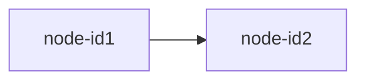
~~~


### direction
- 上→下
  ~~~
  ```mermaid
  graph TB
      node-id1 --> node-id2
  ```
  ~~~

  ```mermaid
  graph TB
      node-id1 --> node-id2
  ```

- 左→右
  ~~~
  ```mermaid
  flowchart LR
      node-id1 --> node-id2
  ```
  ~~~
  ```mermaid
  flowchart LR
      node-id1 --> node-id2
  ```

- 他にも
  | 記法 | 意味          | 備考            |
  |------|---------------|-----------------|
  | TB   | Top → Bottom |                 |
  | TD   | Top → Down   | TB と同じ       |
  | BT   | Bottom → Top | DT はダメっぽい |
  | LR   | Left → Right |                 |
  | RL   | Right → Left |                 |

### title

~~~
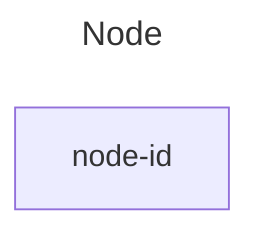
~~~


### alias
記号やUnicode文字を使う場合は `""` で囲む

~~~
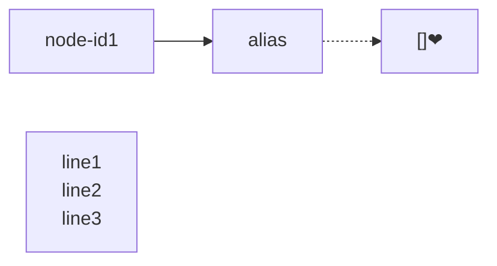
~~~


### ノード

~~~
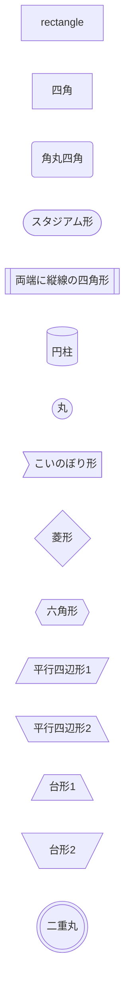
~~~

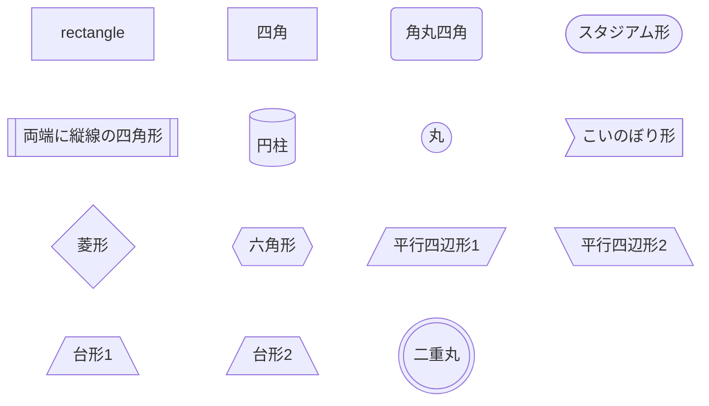

- 新しい書き方 (v11.3.0以降)
  ~~~
  ```mermaid
  graph LR
    rect1@{ shape: rect }
    rect2@{ shape: rect, label: "四角" }
    triangle-alt@{ shape: manual-file, label: "File Handling" }
    docs@{ shape: docs, label: "Multiple Documents" }
  ```
  ~~~
  ```mermaid
  graph LR
    rect1@{ shape: rect }
    rect2@{ shape: rect, label: "四角" }
    triangle-alt@{ shape: manual-file, label: "File Handling" }
    docs@{ shape: docs, label: "Multiple Documents" }

	rect1 ~~~ rect2 ~~~ triangle-alt ~~~ docs
  ```

### ノード同士のリンク
- 矢印
  ~~~
  ```mermaid
  graph LR
      node-id1 --> node-id2
      node-id3 -->|線上に文書1| node-id4 --線上に文書2--> node-id5
      node-id6 --ループもできます--> node-id6
  ```
  ~~~
  ```mermaid
  graph LR
      node-id1 --> node-id2
      node-id3 -->|線上に文書1| node-id4 --線上に文書2--> node-id5
      node-id6 --ループもできます--> node-id6
  ```

- 点線矢印
  ~~~
  ```mermaid
  graph LR
      node-id1 -.-> node-id2
      node-id3 -.->|線上に文書1| node-id4 -.線上に文書2.-> node-id5
  ```
  ~~~
  ```mermaid
  graph LR
      node-id1 -.-> node-id2
      node-id3 -.->|線上に文書1| node-id4 -.線上に文書2.-> node-id5
  ```

- ロング矢印
  `-` や `.` を増やす
  ~~~
  ```mermaid
  graph LR
      node-id1 ---> node-id2
      node-id1 -.-> node-id2
      node-id1 ----> node-id3
      node-id1 -..-> node-id3
      node-id4 --->|線上に文書1| node-id5 --線上に文書2---> node-id6
      node-id4 -..->|線上に文書1| node-id7 -.線上に文書2..-> node-id8
  ```
  ~~~
  ```mermaid
  graph LR
      node-id1 ---> node-id2
      node-id1 -.-> node-id2
      node-id1 ----> node-id3
      node-id1 -..-> node-id3
      node-id4 --->|線上に文書1| node-id5 --線上に文書2---> node-id6
      node-id4 -..->|線上に文書1| node-id7 -.線上に文書2..-> node-id8
  ```

- 太矢印
  ~~~
  ```mermaid
  graph LR
      node-id1 --- node-id2
      node-id3 ---|線上に文書1| node-id4 --線上に文書2--- node-id5
  ```
  ~~~
  ```mermaid
  graph LR
      node-id1 ==> node-id2
      node-id1 ===> node-id3
      node-id4 ==>|線上に文書1| node-id5 ==線上に文書2==> node-id6
  ```

- 接続 (矢印なし)
  `>` を `-` に変える
  ~~~
  ```mermaid
  graph LR
      node-id1 --- node-id2
      node-id1 -.- node-id3
      node-id4 ---|線上に文書1| node-id5 --線上に文書2--- node-id6
      node-id7 -.-|線上に文書1| node-id8 -.線上に文書2-.- node-id6
  ```
  ~~~
  ```mermaid
  graph LR
      node-id1 --- node-id2
      node-id1 -.- node-id3
      node-id4 ---|線上に文書1| node-id5 --線上に文書2--- node-id6
      node-id7 -.-|線上に文書1| node-id8 -.線上に文書2-.- node-id6
  ```

- 透明
  ~~~
  ```mermaid
  graph LR
      node-id1 ~~~ node-id2
      node-id1 ~~~~ node-id3
      %% 2のパターンは使えない？？？
      node-id4 ~~~|線上に文書1| node-id5
  ```
  ~~~
  ```mermaid
  graph LR
      node-id1 ~~~ node-id2
      node-id1 ~~~~ node-id3
      %% 2のパターンは使えない？？？
      node-id4 ~~~|"線上に文書1"| node-id5
  ```

- 新規に追加
  ~~~
  ```mermaid
  graph LR
      %% 丸矢印
      node-id1 --o node-id2
      %% バツ矢印
      node-id1 --x node-id3
      %% 双方向
      node-id3 <--> node-id4
  ```
  ~~~
  ```mermaid
  graph LR
      %% 丸
      node-id1 --o node-id2
      %% ×
      node-id1 --x node-id3
      %% 双方向
      node-id3 <--> node-id4
  ```

### グルーピング
`subgraph` 〜 `end` で括るとグループになる

~~~
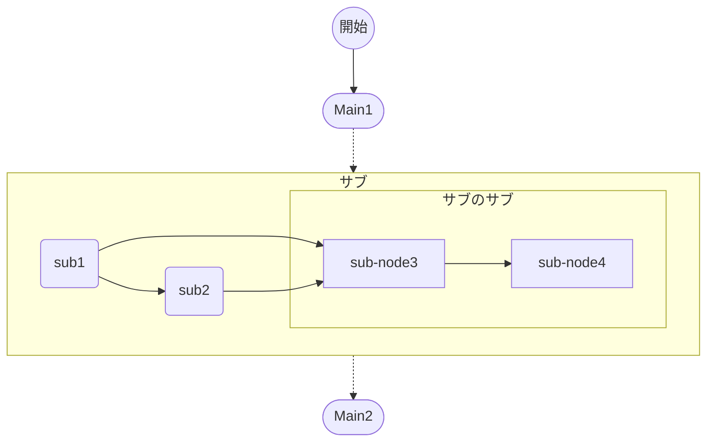
~~~
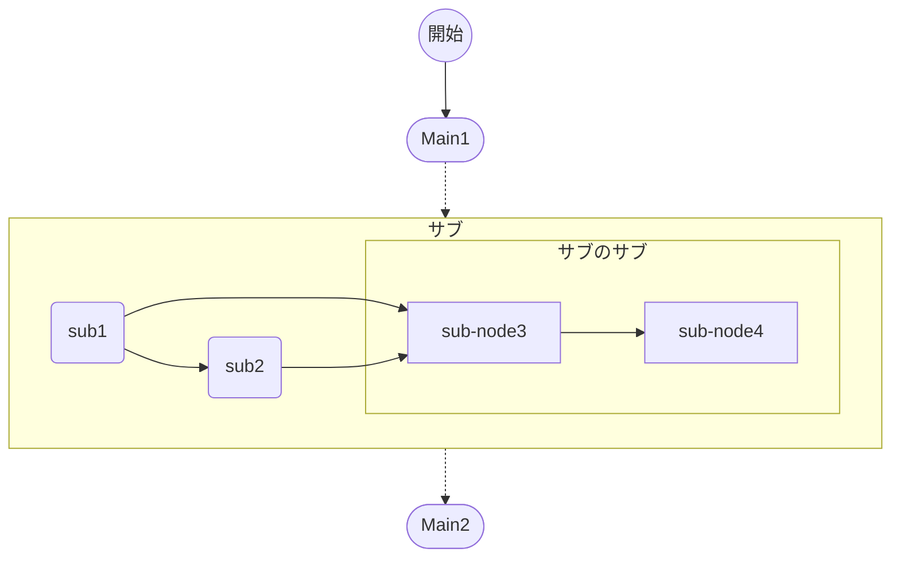

---

## シーケンス図
<https://mermaid.ai/open-source/syntax/sequenceDiagram.html>

冒頭 `sequenceDiagram` で開始
~~~
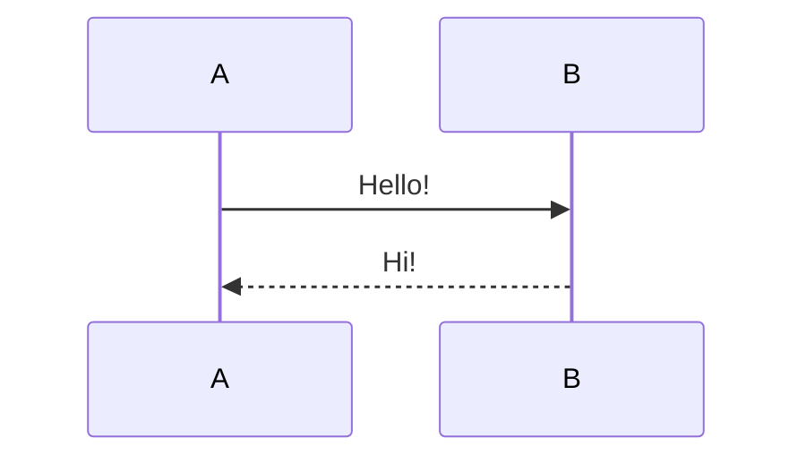
~~~


### 参加者
先に `participant` で定義しておくと、その順番に並ぶ
- ない場合
  ~~~
  ```mermaid
  sequenceDiagram
      B -->> A : Hi!
      A ->> B : Hello!
  ```
  ~~~
  ```mermaid
  sequenceDiagram
      B -->> A : Hi!
      A ->> B : Hello!
  ```

- ある場合
  ~~~
  ```mermaid
  sequenceDiagram
      participant A
      participant B

      B -->> A : Hi!
      A ->> B : Hello!
  ```
  ~~~
  ```mermaid
  sequenceDiagram
      participant A
      participant B

      B -->> A : Hi!
      A ->> B : Hello!
  ```

- `actor` と新しい書き方
  ~~~
  ```mermaid
  sequenceDiagram
      participant A as Alice
      actor B as Bob
      participant C@{ "type" : "database", "alias" : "Cathy" }

      A ->> B : Hello!
      B ->> C : DB query
      C -->> B : DB result
      B --) A : Hi!
  ```
  ~~~
  ```mermaid
  sequenceDiagram
      participant A as Alice
      actor B as Bob
      participant C@{ "type" : "database", "alias" : "Cathy" }

      A ->> B : Hello!
      B ->> C : DB query
      C -->> B : DB result
      B --) A : Hi!
  ```

### 途中作成と消去
`create` `destroy` **の後** に、対象に対するメッセージがないとダメらしい
~~~
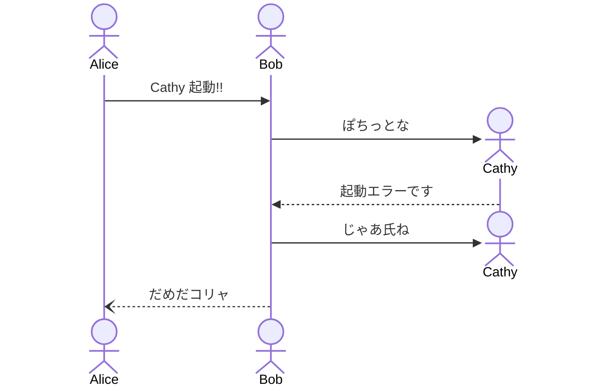
~~~


### グルーピング
~~~
box [Color] [Description]
    ....
end
~~~
(*`Color`* , *`Description`* は省略可能)

~~~
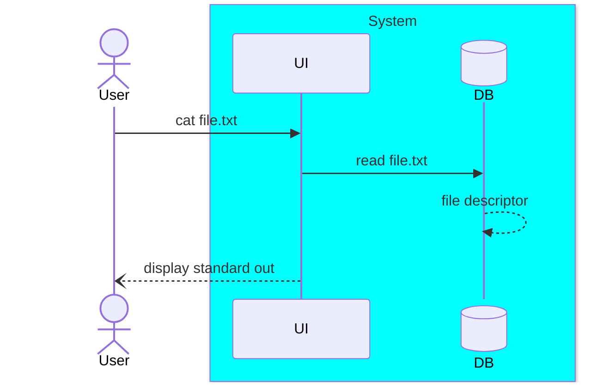
~~~
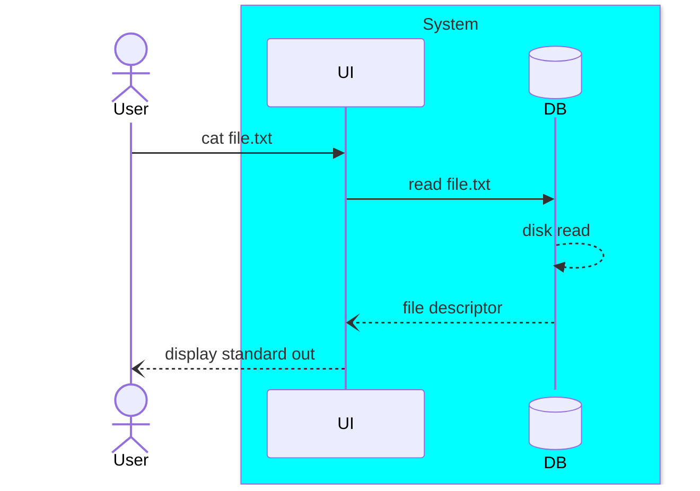

### 矢印 / メッセージ
`参加者 矢印 参加者 : メッセージ`

~~~
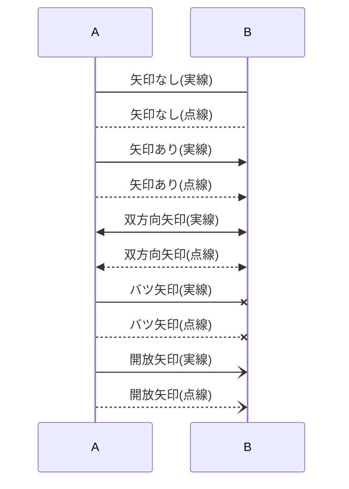
~~~


一般的に
- 点線はレスポンスを示す
- バツ矢印は消去 (`destroy`) を示す
- 開放矢印は非同期を示す

#### 半分矢印 (v11.12.3以降)
~~~
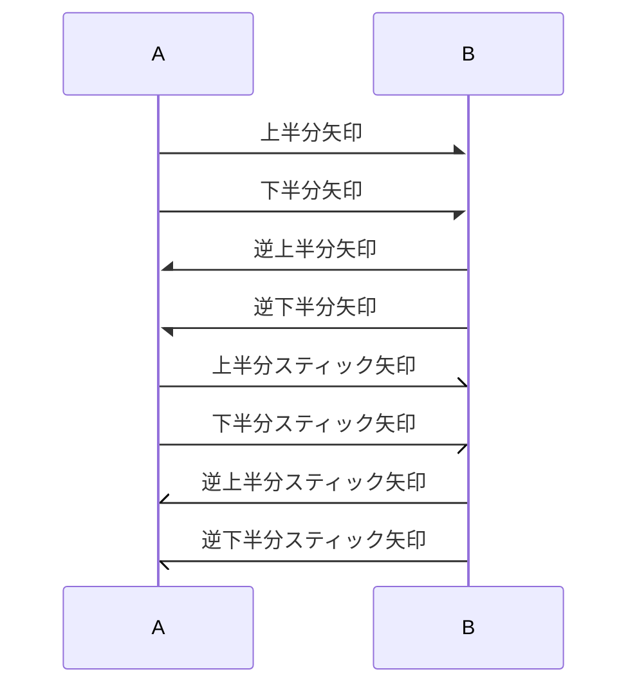
~~~

※`-`を`--`にすると実線が点線になる

<small>([他にも矢印あるみたい…](https://mermaid.ai/open-source/syntax/sequenceDiagram.html#supported-arrow-types))</small>

#### 接続 (v11.12.3以降)
~~~
```mermaid
sequenceDiagram
    A ()->> B : A にポチ
    A ->>() B : B にポチ
    A ()->>() C : A, C にポチ
```
~~~
```mermaid
sequenceDiagram
    A ()->> B : A にポチ
    A ->>() B : B にポチ
    A ()->>() C : A, C にポチ
```

#### Activations (この間タスク握ってるよ、的な)
`activate` で開始、 `deactivate` で終了
~~~
```mermaid
sequenceDiagram
    A ->> B : 要求
    activate B
    B -->> A : レスポンス
    deactivate B

    %%別の書き方
    A ->>+ B : 要求2
    B -->>- A : レスポンス2

    %%多重
    A ->>+ B : 要求
    A ->>+ B : 要求2
    B -->>- A : レスポンス2
    B -->>- A : レスポンス
```
~~~
```mermaid
sequenceDiagram
    A ->> B : 要求
    activate B
    B -->> A : レスポンス
    deactivate B

    %%別の書き方
    A ->>+ B : 要求2
    B -->>- A : レスポンス2

    %%多重
    A ->>+ B : 要求3
    A ->>+ B : 要求4
    B -->>- A : レスポンス4
    B -->>- A : レスポンス3
```

### Note (テキスト重ね書き)
~~~
```mermaid
sequenceDiagram
    note left of A: Aの左にテキスト
    note over A: Aの上にテキスト
    note right of A: Aの右にテキスト
    note over A,B: A,Bの上にテキスト
```
~~~
```mermaid
sequenceDiagram
    note left of A: Aの左にテキスト
    note over A: Aの上にテキスト
    note right of A: Aの右にテキスト
    note over A,B: A,Bの上にテキスト
```

### 改行
~~~
```mermaid
sequenceDiagram
    actor AB as Alice<br/>Bob
    participant CC as Cathy<br/>Cate
    AB //- CC : Hello,<br/>World!
    note over AB,CC: foo<br/>bar
```
~~~
```mermaid
sequenceDiagram
    actor AB as Alice<br/>Bob
    participant CC as Cathy<br/>Cate
    AB //- CC : Hello,<br/>World!
    note over AB,CC: 何とも言えない<br/>空気
```

### ループ
~~~
```mermaid
sequenceDiagram
    loop 100回
        A ->> B : Hello!
        B -->> A : Hi!
    end
```
~~~
```mermaid
sequenceDiagram
    loop 100回
        A ->> B : Hello!
        B -->> A : Hi!
    end
```

### 分岐
#### Alt (代替経路)
`if` 〜 `else` 〜 `end`
~~~
```mermaid
sequenceDiagram
    alt x > y
        A ->> B : x
    else
        A ->> B : y
    end
```
~~~
```mermaid
sequenceDiagram
    alt x > y
        A ->> B : x
    else
        A ->> B : y
    end
```

#### opt (省略)
`if` 〜 `end`
<small>でも、`alt`〜`end`って書いてもエラーにならんのだが…。存在意義がわからん。</small>
~~~
```mermaid
sequenceDiagram
    opt x > y
        A ->> B : x
    end
```
~~~
```mermaid
sequenceDiagram
    opt x > y
        A ->> B : x
    end
```

### 並列
~~~
```mermaid
sequenceDiagram
    alt x > y
        A ->> B : x
    else
        A ->> B : y
    end
```
~~~
```mermaid
sequenceDiagram
    par Alice to Bob
        Alice ->> Bob : Hello!
    and Alice to Cathy
        Alice ->> Cathy : Hi!
    end
```

### Critical Region
特定のタイミングでは1つのスレッド(アクター)しか入れない、排他制御が必要な領域を表す

~~~
``` mermaid
sequenceDiagram
    critical DBとの接続確立 ※排他
        Service-->DB: connect
    option Network timeout
        Service-->Service: Log timeout
    option Credentials rejected
        Service-->Service: Log rejected
    end
```
~~~

``` mermaid
sequenceDiagram
    critical DBとの接続確立 ※排他
        Service-->DB: connect
    option Network timeout
        Service-->Service: Log timeout
    option Credentials rejected
        Service-->Service: Log rejected
    end
```
※`option`は省略可能

### Break (中断)
~~~
```mermaid
sequenceDiagram
    A ->> B : 要求
    B ->> C : 処理
    break エラー発生!
      B --) A : あぼん
    end
    B --) A : 成功!
```
~~~
```mermaid
sequenceDiagram
    A ->> B : 要求
    B ->> C : 処理
    break エラー発生!
      B --) A : あぼん
    end
    B --) A : 成功!
```
